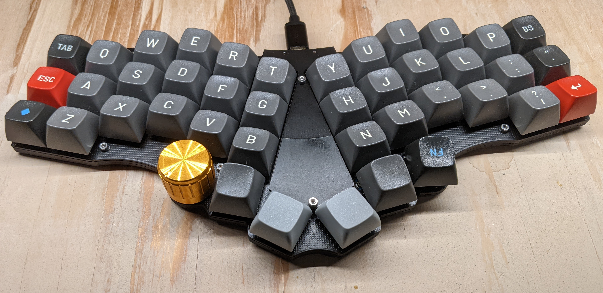
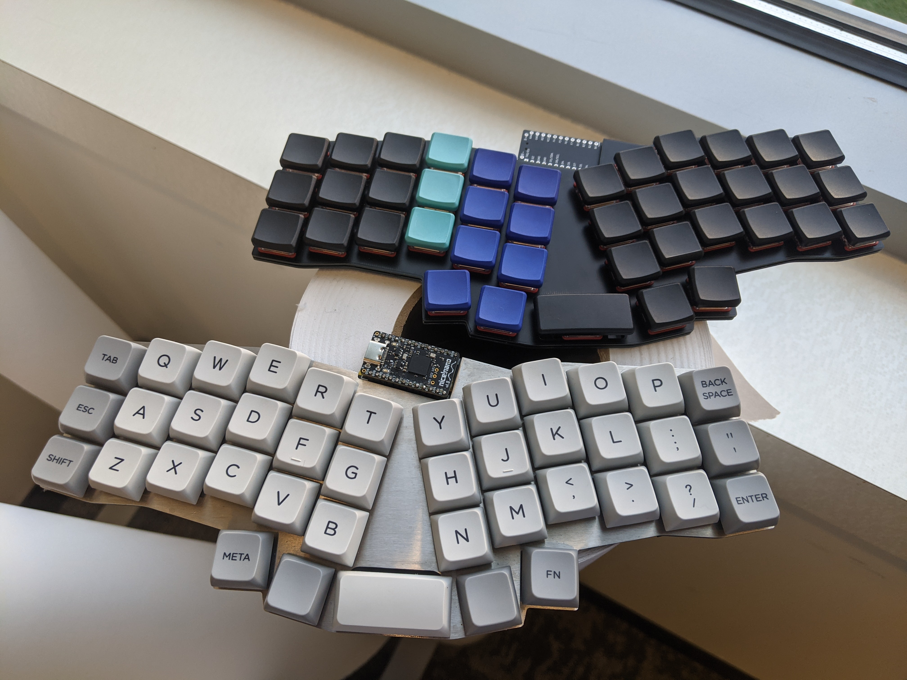
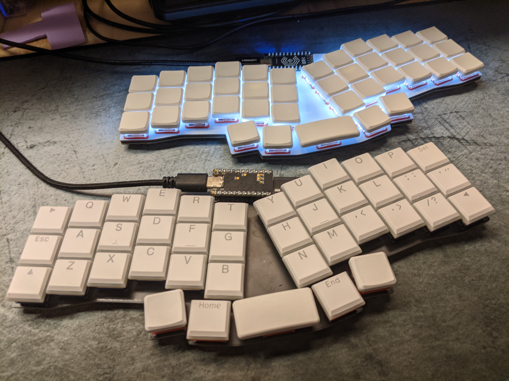

# One42 | low-profile 42-key Wireless
choc-v2 & v1 switches, MX-spaced, integrated/onboard nrf52840 controller  

# rev41l2 / 41-1353 | low-profile Reviung41 variant
choc-v2 & v1 switches, MX-spaced  

# rev41lp / 41-1350 | low-profile Reviung41 variant
choc-v1 switches, choc-spaced, hotswap, single-color backlit  
