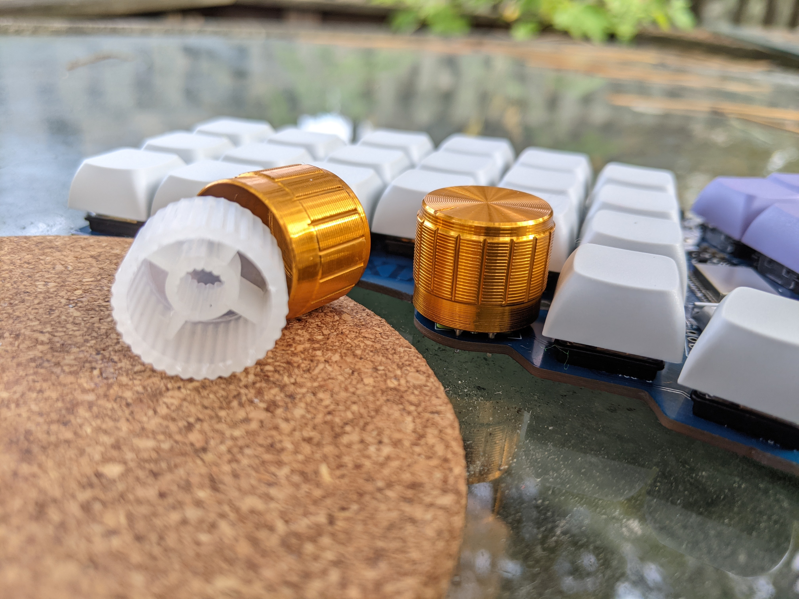
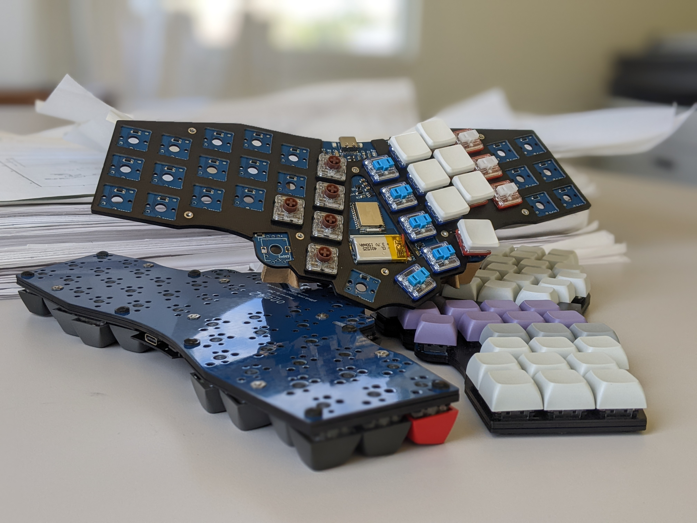

# One42 | 42-key Wireless

- v2 (& v1) choc switches (soldered)
- Integrated/onboard wireless controller (holyiot 18010; hello ZMK!)
- 18.8mm sq.spacing (most keycap dimensions are actually 18.0-18.3mm)
- 30 degree angled halves
- Rotary encoders (2x optional) at outer-thumb positions **
- 100% Hand-solderable
- Minimally cased by Integrated switchplate, skid-plate, & component-cover

## Firmware
[zmk-config](https://github.com/cyril279/zmk-config-one42) << fork, adjust the keymap, and let github build your firmware.  
There are links to the bootloader (if needed), as well as flashing instructions at the link-above.  
For more info on ZMK itself, [* start here *](https://zmk.dev/docs)  

## Encoder fitment
The placement of these encoders allows the use of 21mm diameter knobs.  
  At this diameter, some of the knobs are able to fit down over the body of the encoder for a lower-profiled encoder.  
  Shown below is a 12mm tall encoder adorned with a 21mm diameter knob.  

## Encasement
A switch-plate, skid-plate, and component cover were designed to make this build nicer to handle and to look at.  
- The switchplate is a 1mm fr4 plate which helps to align the switches, as well as increase curb-appeal. By design, this gets soldered to the pcb via the plated mount-holes.  
- The skidplate is a 1.6mm fr4 plate designed to be fastened to the bottom of the pcb, creating a surface that is much more friendly to handle and have in a bag or backpack, while minimally increasing the height of the overall build.  
- The component-cover is another fr4 plate that covers the topside components.  

## Lessons-learned v0.1 / plans & thoughts for v0.2
1) The pg-1353 switches do not self-align well without a switch-plate.  
  I had hoped (assumed) that the third-leg of the 1353's would do a sufficient job of positioning the switches.  
  My previous designs all involved switch-plates (for aesthetic reasons) so I was unaware that this would be an issue.    
  Switch-plate will be... less optional.  
2) The oval holes for the encoder remove the alignment features for the pg-1350 (choc-v1) switches.  
  The switchplate helps, but does not completely remedy this issue.  
3) Skidplate:  
    a) I will experiment with plating the mount-holes, so that the threaded-inserts can be soldered.  
    b) Leave the copper fill out of the antenna region. This does not seem to affect the current boards, but it was an oversight that it is not removed directly below the antenna.  
4) Component cover: This needs a better finish, but copper filling the whole thing is not an option, because it risks wrecking the wireless signal.  

## Thank You.
- [gtips reviung41](https://github.com/gtips/reviung) was the initial inspiration  
- [dezli’s ahokore](https://github.com/dezlidezlidezli/ahokore) was the template for the zmk-config & electrical-schematic  
- The [low-profile keyboard discord](https://discord.gg/eEK5yUh) is wonderfully encouraging and supportive  
- All things open-source!  
